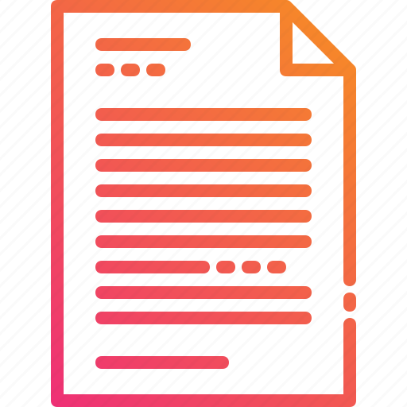

[![Contributors][contributors-shield]][contributors-url]
[![Forks][forks-shield]][forks-url]
[![Stargazers][stars-shield]][stars-url]
[![Issues][issues-shield]][issues-url]
[![MIT License][license-shield]][license-url]
[![LinkedIn][linkedin-shield]][linkedin-url]

<!-- PROJECT LOGO -->

 

  
  

  <h3 align="center">README</h3>

  

    The Code Magazine, a practice in producing responsive HTML & CSS websites while solidifying the principles of website development
   
  

<!-- TABLE OF CONTENTS -->

  
Table of Contents

  <ol>
    <li>
      <a href="#about-the-project">About The Project</a>
      <ul>
        <li><a href="#built-with">Built With</a></li>
      </ul>
    </li>
    <li><a href="#license">License</a></li>
    <li><a href="#contact">Contact</a></li>
    <li><a href="#acknowledgments">Acknowledgments</a></li>
  </ol>

<!-- ABOUT THE PROJECT -->

## About The Project

![The Code Magazine][product-screenshot]

This project was generated for purpose of polishing HTML and CSS fundamentals for website development.

(<a href="#readme-top">back to top</a>)

### Built With

Static HTML and CSS was utilized to produce the end product for this project.

(<a href="#readme-top">back to top</a>)

<!-- LICENSE -->

## License

Distributed under the MIT License. See `LICENSE.txt` for more information.

(<a href="#readme-top">back to top</a>)

<!-- CONTACT -->

## Contact

Skyler Hantz - skyler.hantz@gmail.com

(<a href="#readme-top">back to top</a>)

<!-- ACKNOWLEDGMENTS -->

## Acknowledgments

Jonas Schmedtmann, author of the course Build Responsive Real-World Websites with HTML and CSS on Udemy.com deserves credit for the original creation of this work.

- [Build Responsive Real-World Websites with HTML and CSS](https://www.udemy.com/course/design-and-develop-a-killer-website-with-html5-and-css3/)
- [Choose an Open Source License](https://choosealicense.com)

(<a href="#readme-top">back to top</a>)

<!-- MARKDOWN LINKS & IMAGES -->

[contributors-shield]: https://img.shields.io/github/contributors/Balantzer/The-Code-Magazine.svg?style=for-the-badge
[contributors-url]: https://github.com/Balantzer/The-Code-Magazine/graphs/contributors
[forks-shield]: https://img.shields.io/github/forks/Balantzer/The-Code-Magazine.svg?style=for-the-badge
[forks-url]: https://github.com/Balantzer/The-Code-Magazine/network/members
[stars-shield]: https://img.shields.io/github/stars/Balantzer/The-Code-Magazine.svg?style=for-the-badge
[stars-url]: https://github.com/Balantzer/The-Code-Magazine/stargazers
[issues-shield]: https://img.shields.io/github/issues/Balantzer/The-Code-Magazine.svg?style=for-the-badge
[issues-url]: https://github.com/Balantzer/The-Code-Magazine/issues
[license-shield]: https://img.shields.io/github/license/Balantzer/The-Code-Magazine.svg?style=for-the-badge
[license-url]: https://github.com/Balantzer/The-Code-Magazine/blob/main/LICENSE.txt
[linkedin-shield]: https://img.shields.io/badge/-LinkedIn-black.svg?style=for-the-badge&logo=linkedin&colorB=555
[linkedin-url]: https://www.linkedin.com/in/skylerhantz
[product-screenshot]: images/screenshot.png
